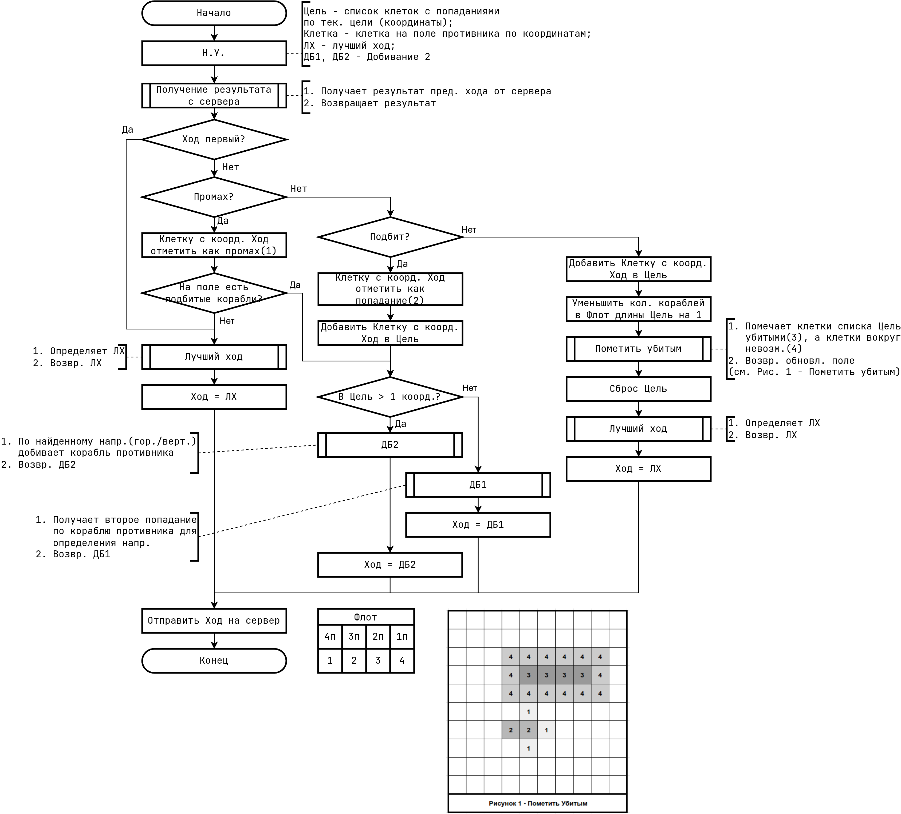
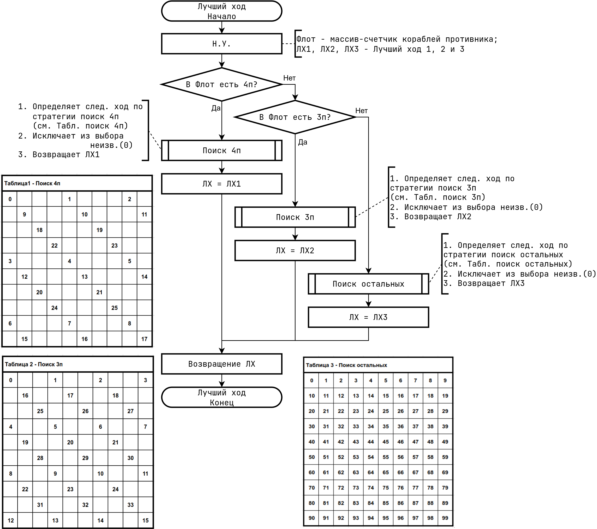
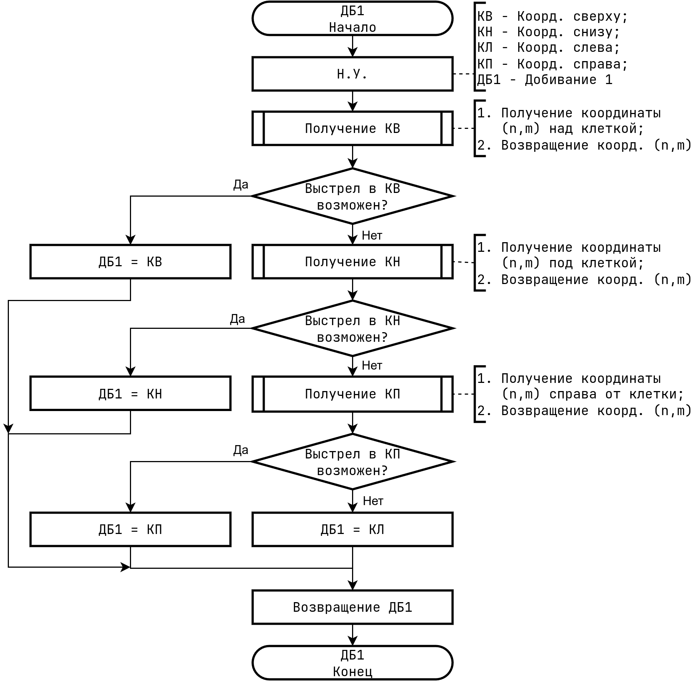
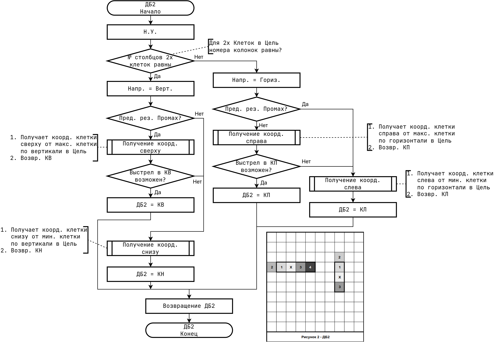

# Описание бота для игры "Морской Бой"

## Игровые элементы

**Поле**: Сетка 10×10 клеток с координатами от (0,0) до (9,9).

**Флот**:

- 1×4 клетки (четырехпалубный)
- 2×3 клетки (трехпалубные)
- 3×2 клетки (двухпалубные)
- 4×1 клетка (однопалубные)

**Результаты выстрелов**:

- 0: Промах
- 2: Попадание (корабль не уничтожен)
- 3: Уничтожение (корабль полностью уничтожен)

**Состояния клеток поля противника**:

- 0: Неизвестная (не стреляли)
- 1: Промах
- 2: Попадание
- 3: Уничтоженный корабль
- 4: Невозможная (вокруг уничтоженного корабля)

## Внутренние состояния бота

- Режим работы: поиск или добивание
- Матрица поля противника 10×10
- Счетчики живых кораблей по размерам
- Очередь клеток для стрельбы в режиме поиска
- Список попаданий в текущий корабль
- Направление корабля: горизонтальное/вертикальное/неизвестное
- Индекс расстановки (0-5, циклически)

## Основной цикл работы

**Инициализация игры**: Установка начального индекса расстановки.

**Начало сета**:

- Поле противника: все клетки неизвестны (0)
- Счетчики кораблей: 4-3-2-1 по размерам 1-2-3-4
- Режим: поиск
- Сброс переменных добивания
- Инициализация очереди поиска

**Расстановка кораблей**: Возврат одной из 6 предопределенных расстановок, увеличение индекса.

**Выстрел**: Выбор клетки по режиму (из очереди или расчет для добивания).

**Обработка результата**:

- Промах (0): клетка → 1
- Попадание (2): клетка → 2, добавить в массив попаданий, активировать режим добивания, определить направление
- Уничтожение (3): клетки корабля → 3, вокруг → 4, уменьшить счетчик, сброс в режим поиска

После обработки в режиме поиска обновляется очередь.

## Режим поиска

Стрельба по оптимизированной стратегии, зависящей от размера самого большого живого корабля.

### Четырехпалубные (6 проходов)

- Проход 1 смещение(0,0): (0,0), (0,4), (0,8), (4,0), (4,4), (4,8), (8,0), (8,4), (8,8)
- Проход 2 смещение(1,1): (1,1), (1,5), (1,9), (5,1), (5,5), (5,9), (9,1), (9,5), (9,9)
- Проход 3 смещение(2,2): (2,2), (2,6), (6,2), (6,6)
- Проход 4 смещение(3,3): (3,3), (3,7), (7,3), (7,7)
- Проход 5 смещение(4,4): (4,4), (4,8), (8,4), (8,8)
- Проход 6 смещение(5,5): (5,5), (5,9), (9,5), (9,9)

### Трехпалубные (4 прохода)

- Проход 1 смещение(0,0): (0,0), (0,3), (0,6), (0,9), (3,0), (3,3), (3,6), (3,9), (6,0), (6,3), (6,6), (6,9), (9,0), (9,3), (9,6), (9,9)
- Проход 2 смещение(1,1): (1,1), (1,4), (1,7), (4,1), (4,4), (4,7), (7,1), (7,4), (7,7)
- Проход 3 смещение(2,2): (2,2), (2,5), (2,8), (5,2), (5,5), (5,8), (8,2), (8,5), (8,8)
- Проход 4 смещение(3,3): (3,3), (3,6), (3,9), (6,3), (6,6), (6,9), (9,3), (9,6), (9,9)

### Двухпалубные и однопалубные

Очередь заполняется всеми неизвестными клетками слева направо, сверху вниз.

## Режим добивания

Активируется при первом попадании (результат = 2).

**Одиночное попадание**: Стрельба в 4 направления (вверх/вниз/влево/вправо) от клетки попадания.

**Два и более попадания**: Определение направления:

- Все попадания в одном ряду → горизонтальное
- Все попадания в одном столбце → вертикальное

**Для горизонтального корабля**:

- Сортировка попаданий по столбцу
- Стрельба вдоль линии (заполнение пробелов)
- Стрельба на одну клетку за крайними попаданиями

**Для вертикального корабля**: Аналогично, сортировка по строке.

**При уничтожении**:

- Клетки попаданий → 3
- Вокруг корабля → 4
- Уменьшение счетчика типа корабля
- Сброс в режим поиска

## Схема алгоритма

---

---

---

