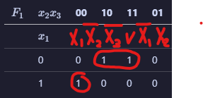
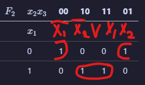
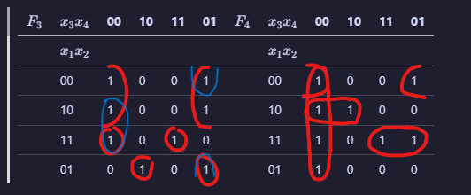

| $F_1$ | $x_2 x_3$ | 00  | 10  | 11  | 01  | $F_2$ | $x_2 x_3$ | 00  | 10  | 11  | 01  |
| ----- | --------- | --- | --- | --- | --- | ----- | --------- | --- | --- | --- | --- |
|       | $x_1$     |     |     |     |     |       | $x_1$     |     |     |     |     |
|       | 0         | 0   | 1   | 1   | 0   |       | 0         | 1   | 0   | 0   | 1   |
|       | 1         | 1   | 0   | 0   | 0   |       | 1         | 0   | 1   | 1   | 0   |

 

| $x_1$ | $x_2$ | $x_3$ | $F_1$ | $F_2$ |
| ----- | ----- | ----- | ----- | ----- |
| 0     | 0     | 0     | 0     | 1     |
| 0     | 0     | 1     | 0     | 1     |
| 0     | 1     | 0     | 1     | 0     |
| 0     | 1     | 1     | 1     | 0     |
| 1     | 0     | 0     | 1     | 0     |
| 1     | 0     | 1     | 0     | 0     |
| 1     | 1     | 0     | 0     | 1     |
| 1     | 1     | 1     | 0     | 1     |

| $F_3$ | $x_3 x_4$ | 00  | 10  | 11  | 01  | $F_4$ | $x_3 x_4$ | 00  | 10  | 11  | 01  |
| ----- | --------- | --- | --- | --- | --- | ----- | --------- | --- | --- | --- | --- |
|       | $x_1 x_2$ |     |     |     |     |       | $x_1 x_2$ |     |     |     |     |
|       | 00        | 1   | 0   | 0   | 1   |       | 00        | 1   | 0   | 0   | 1   |
|       | 10        | 1   | 0   | 0   | 1   |       | 10        | 1   | 1   | 0   | 0   |
|       | 11        | 1   | 0   | 1   | 0   |       | 11        | 1   | 0   | 1   | 1   |
|       | 01        | 0   | 1   | 0   | 1   |       | 01        | 1   | 0   | 0   | 0   |

| $x_1$ | $x_2$ | $x_3$ | $x_4$ | $F_3$ | $F_4$ |
| ----- | ----- | ----- | ----- | ----- | ----- |
| 0     | 0     | 0     | 0     | 1     | 1     |
| 0     | 0     | 0     | 1     | 1     | 1     |
| 0     | 0     | 1     | 0     | 0     | 0     |
| 0     | 0     | 1     | 1     | 0     | 0     |
| 0     | 1     | 0     | 0     | 0     | 1     |
| 0     | 1     | 0     | 1     | 1     | 0     |
| 0     | 1     | 1     | 0     | 1     | 0     |
| 0     | 1     | 1     | 1     | 0     | 0     |
| 1     | 0     | 0     | 0     | 1     | 1     |
| 1     | 0     | 0     | 1     | 1     | 0     |
| 1     | 0     | 1     | 0     | 0     | 1     |
| 1     | 0     | 1     | 1     | 0     | 0     |
| 1     | 1     | 0     | 0     | 1     | 1     |
| 1     | 1     | 0     | 1     | 0     | 1     |
| 1     | 1     | 1     | 0     | 0     | 0     |
| 1     | 1     | 1     | 1     | 1     | 1     |
